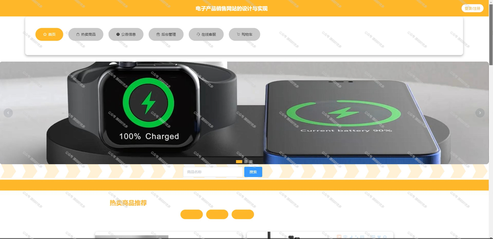
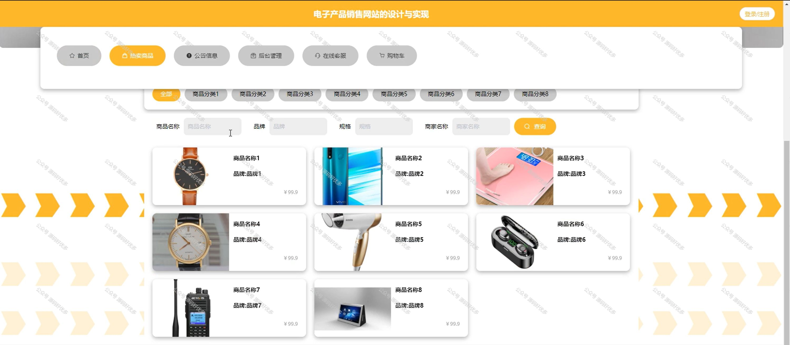
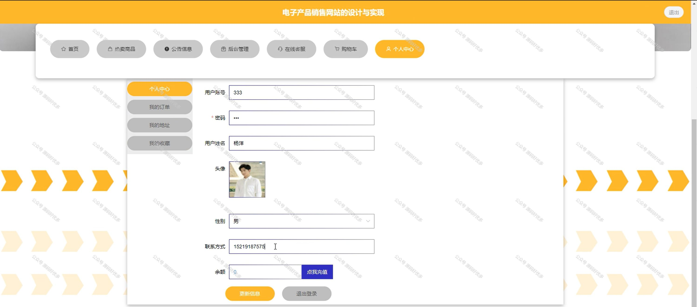
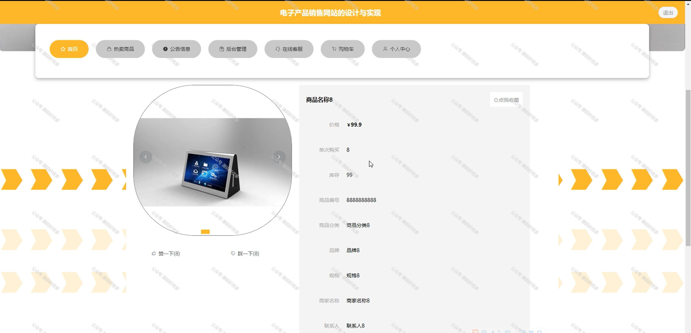
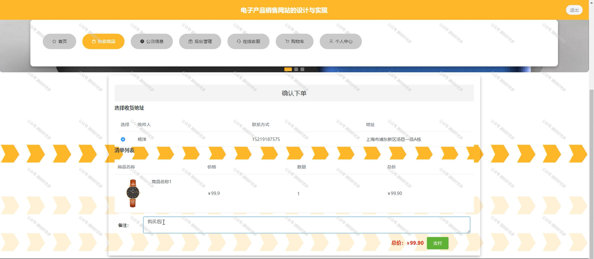
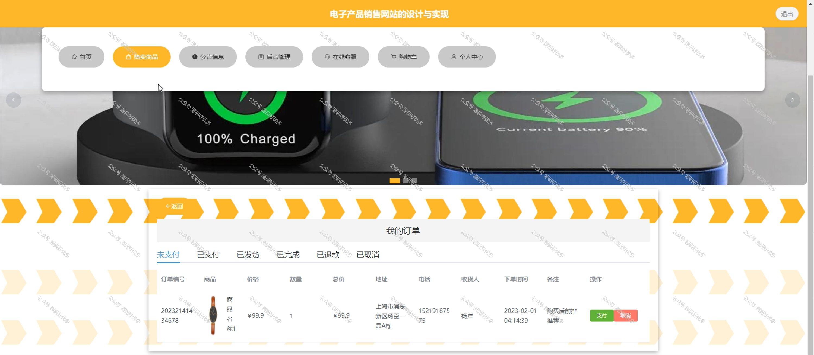
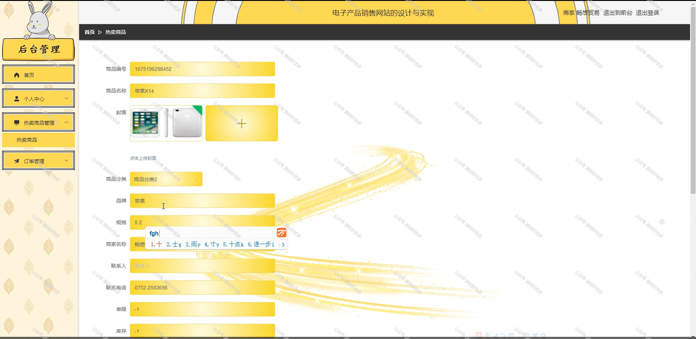
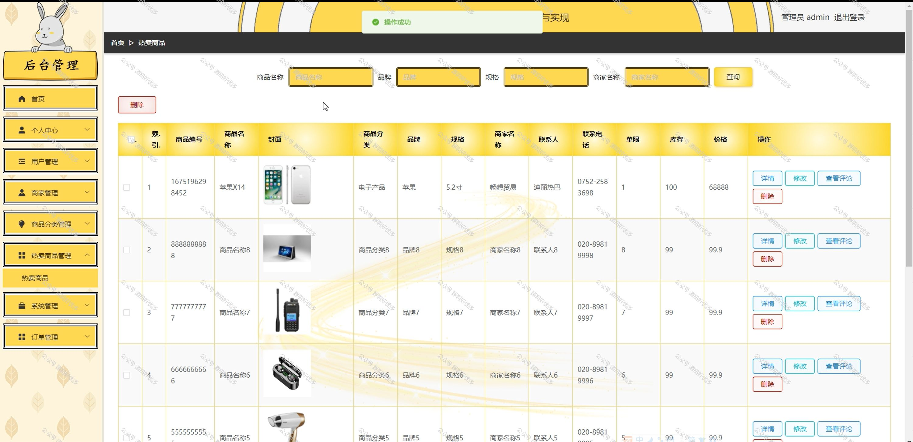

 
## 查看主页获取源码

> **作者介绍**： **✌**全网粉丝10W+本平台特邀作者、博客专家、CSDN新星计划导师、java领域优质创作者,博客之星、掘金/华为云/阿里云/InfoQ等平台优质作者、专注于项目实战 **✌**

  

### 一、作品包含

源码+数据库+全套环境和工具资源+部署教程

### 二、项目技术

前端技术：Html、Css、Js、Vue、Element-ui

数据库：MySQL

后端技术：Java、Spring Boot、MyBatis

  

### 三、运行环境

开发工具：IDEA/eclipse

数据库：MySQL5.7

数据库管理工具：Navicat10以上版本

环境配置软件： JDK1.8+Maven3.6.3

前端Nodejs：14

### 四、项目介绍
项目编号：springbootA147

电子产品销售网站是在数字化时代背景下，为了满足消费者对各类电子产品日益增长的需求而建立的在线购物平台。该网站集合了最新的科技产品，提供详尽的产品信息、优惠的价格、便捷的购物流程和高效的客户服务，旨在为消费者打造一站式的电子产品购买体验，同时推动电子零售行业的发展。

前台用户功能：首页、热卖商品、公告信息、后台管理、在线客服、购物车、个人中心。

后台分为管理员和店家
管理员的功能：首页、个人中心、用户管理、商家管理、商品分类管理、热卖商品管理、系统管理、订单管理。
店家的功能：首页、个人中心、热卖商品管理、订单管理。

### 五、运行截图

  

